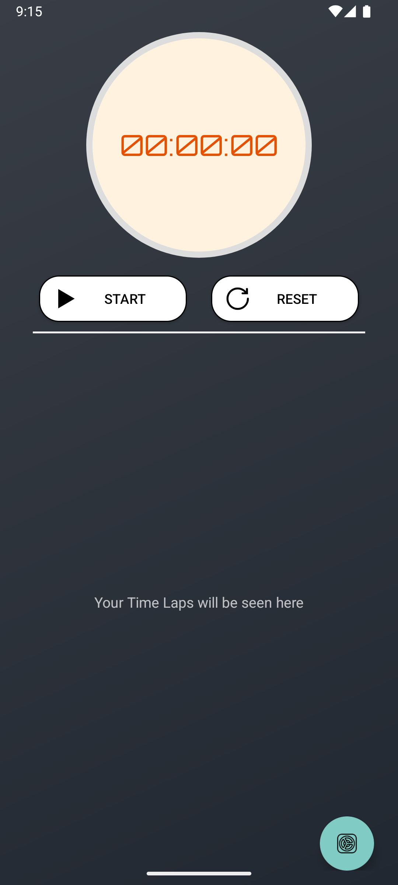
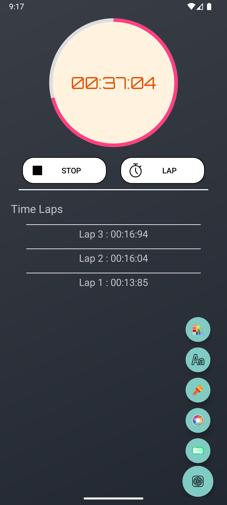
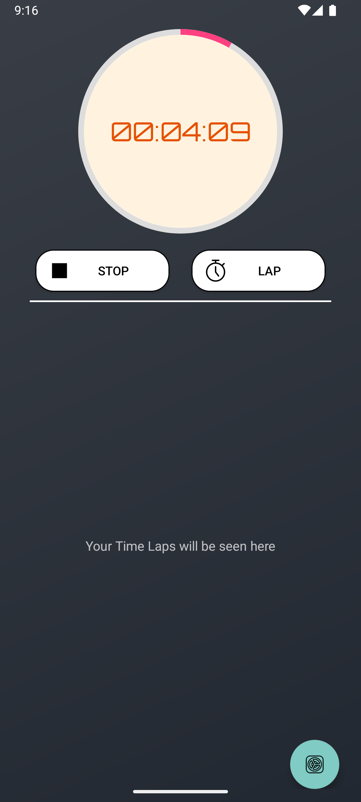
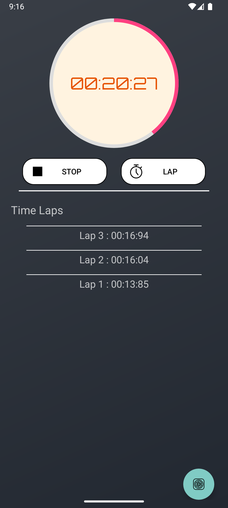
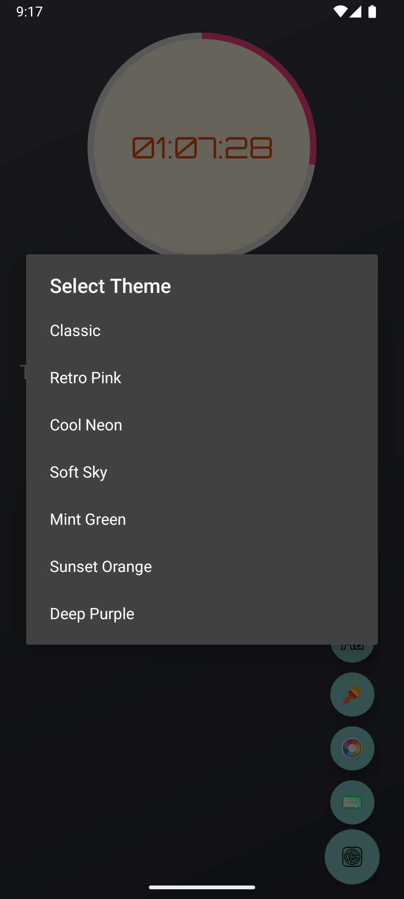
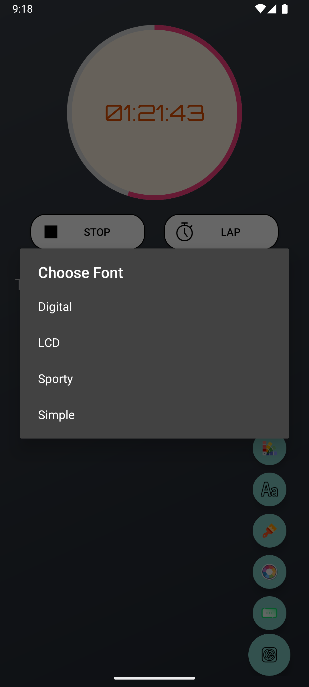
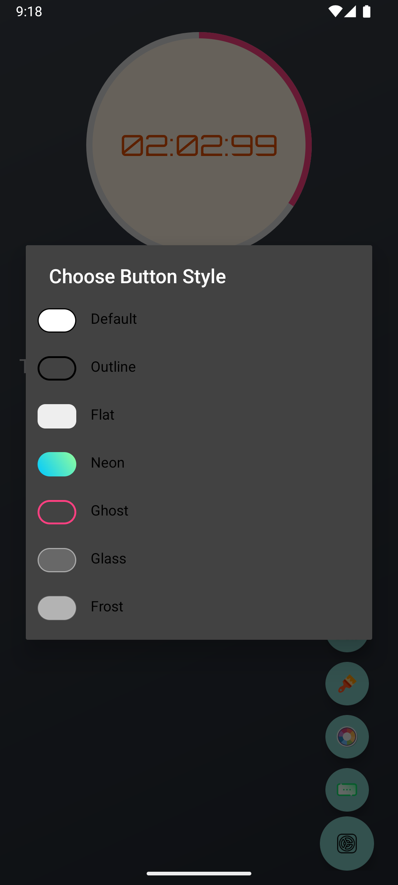

# ⏱️ Stoppy – Smart Stopwatch App

**Stoppy** is a modern, feature-rich stopwatch Android application built with Kotlin. It combines elegant UI, customizable themes, and smooth animations to deliver a premium stopwatch experience.

---

## ✨ Features

- Stylish digital timer with animated progress ring
- Custom button styles (Glass, Neon, Ghost, Frost, etc.)
- Font customization (LCD, Digital, Sporty, Simple)
- Choose font and background colors
- Predefined theme packs with font + color presets
- Haptic feedback on timer actions
- Floating Action Button (FAB) menu for quick settings
- Save and restore laps across sessions
- Responsive layout tested on multiple device sizes
---
## 📱 App Screenshots

| Splash | Home | Settings |
|--------|------|----------|
|  |  |  |

| Timer Started | Lap List | Background Color Picker |
|---------------|----------|--------------------------|
|  |  |  |

| Theme Picker | Font Style Picker | Button Style Picker |
|-------------------|-------------------|----------------------|
|  |  |  |

---
## 📹 Demo Video
[👉 Demo video] (https://drive.google.com/file/d/1iw6J90HnnQpGPSQFO2lG9HW7EaPm5iJb/view?usp=drive_link)

---
## 📦 Download APK
[👉 Download APK] (https://drive.google.com/file/d/1CKc9zbtE8lXifjosV8-7x0zO6gGbIqOu/view?usp=drive_link)

---
## 🚀 Tech Stack

- Kotlin
- MVVM architecture
- Data Binding
- SharedPreferences
- ConstraintLayout & CoordinatorLayout
- Custom drawables and styles

---
